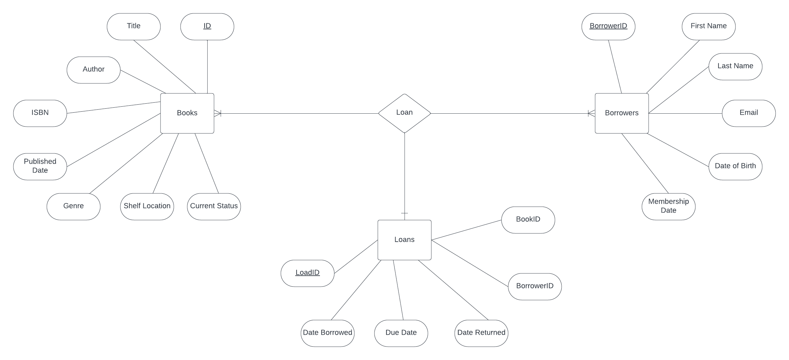

# Tech-Lib

    <h1>SQL Documentation - Tech lib Database</h1>
    <h2>Tables</h2>
    <h3>Books Table</h3>
    

        The "Books" table stores information about books in the library.
    

    <ul>
        <li>Book_Id (Primary Key)</li>
        <li>Title</li>
        <li>Author</li>
        <li>ISBN</li>
        <li>Published_Date</li>
        <li>Genre</li>
        <li>Shelf_Location</li>
        <li>Current_Status (Checked: 'Borrowed', 'Available', Not Null)</li>
    </ul>
    <h3>Borrowers Table</h3>
    

        The "Borrowers" table stores information about library borrowers.
    

    <ul>
        <li>Borrower_Id (Primary Key)</li>
        <li>First_Name</li>
        <li>Last_Name</li>
        <li>Email (Unique, Checked for email format)</li>
        <li>Date_Of_Birth</li>
        <li>Membership_Date</li>
    </ul>
    <h3>Loans Table</h3>
    

        The "Loans" table tracks book loans to borrowers.
    

    <ul>
        <li>Loan_Id (Primary Key)</li>
        <li>Book_Id (Foreign Key to Books)</li>
        <li>Borrower_Id (Foreign Key to Borrowers)</li>
        <li>Date_Borrowed</li>
        <li>Due_Date (Not Null)</li>
        <li>Date_Returned</li>
    </ul>
    <h3>AuditLog Table</h3>
    

        The "AuditLog" table records changes in book status.
    

    <ul>
        <li>Book_Id (Foreign Key to Books)</li>
        <li>Status_Change</li>
        <li>Change_Date</li>
    </ul>
    <h2>Stored Procedures</h2>
    <h3>sp_Stored_Procedure_With_Temp_Table</h3>
    

        This stored procedure identifies borrowers with overdue books.
    

    <h3>sp_BorrowedBooksReport</h3>
    

        This stored procedure generates a report of borrowed books within a date range.
    

    <h2>Triggers</h2>
    <h3>Change_Book_Status Trigger</h3>
    

        This trigger logs changes in book status to the "AuditLog" table.
    

